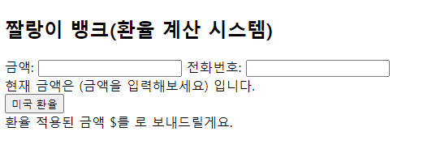
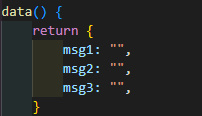
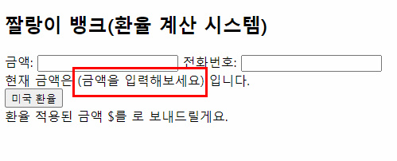
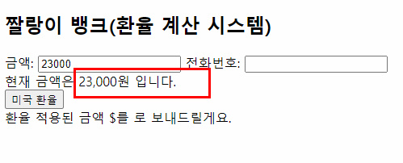
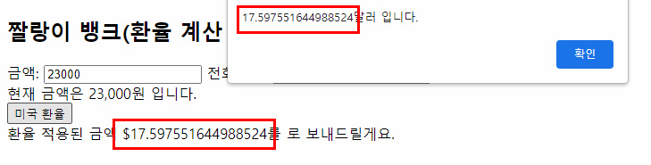
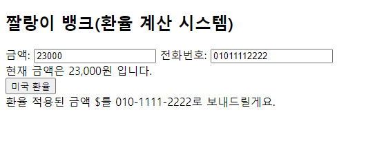
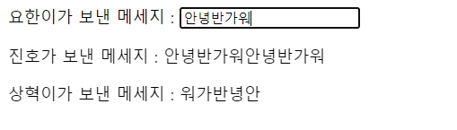

## 22.08.10

## [🦊index1 소연 문제(짤랑이 뱅크)]

### [문제설명]

1. `index1.html`을 생성하시오.

   <초기화면>

   

2. 다음 이미지를 참고하여 data()를 구현하시오.

   

3. `price` 필터와 `call` 필터를 `전역 필터`로 구현하시오.
   - `price` 필터(`msg1` 사용)
     - value매개변수가 없으면, value매개변수를 그대로 출력하시오.
     - value매개변수가 있으면, value를 [ /\B(?=(\d{3})+(?!\d))/g, ',’ ] 정규식으로 대체하시오.
   - `call` 필터(`msg2` 사용)
     - value매개변수가 없거나 길이가 10 또는 11이 아니라면, value매개변수를 그대로 출력하시오.
     - value매개변수가 있거나 길이가 10 또는 11이라면 , value를 [ /^(\d{3})(\d{3,4})(\d{4})/g, '$1-$2-$3’] 정규식으로 대체하시오.
4. `won`을 `지역 필터`로 구현하시오.
   - `won` 필터
     - value매개변수의 길이가 0이라면 `alternative(대체값)`을 출력하고 아니라면 `금액+”원”`이 보이게 하여라.
       
       
5. 미국 환율 버튼을 클릭하면 `trans`메서드가 호출된다.

- `trans`메서드
  - 버튼을 클릭하면 알림창에 계산된 환율이 보이게 한다. `1달러=1307원`으로 계산한다.
  - 계산된 환율을 마지막 문장에 넣게 한다.(`msg3` 사용)
    

### [문제 포인트]

- filter

### [알게된 점]

### [출력 예시 화면]

💡참고 이미지

## [🐼index2 길연 문제(요한이와 친구들)]

### [문제설명]

- 요한이가 친구들과 메세지를 주고 받고 있다. 요한이의 친구인 진호와 상혁이는 다음과 같이 말하는 경향이 있다.
- 진호 : 요한이가 보내는 메세지를 붙여서 두번 출력한다.
- 상혁 : 요한이가 보내는 메세지를 거꾸로 출력한다.
- 요한이가 보내는 메세지를 입력하면 진호와 상혁이가 보내는 메세지를 출력하는 `index.html`을 생성하시오.
- reversedMsg1 : 진호가 보내는 메세지를 return하는 함수
- reversedMsg2 : 상혁이가 보내는 메세지를 return하는 함수
- 단, method가 아닌 **computed**안에 reversedMsg1 과 reversedMsg2를 생성하시오.

### [문제 포인트]

- computed

### [알게된 점]

### [출력 예시 화면]

💡 <참고 화면>

