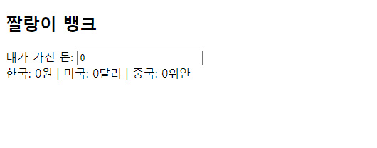
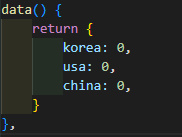
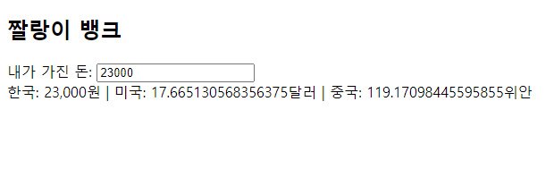
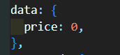
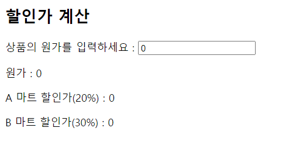
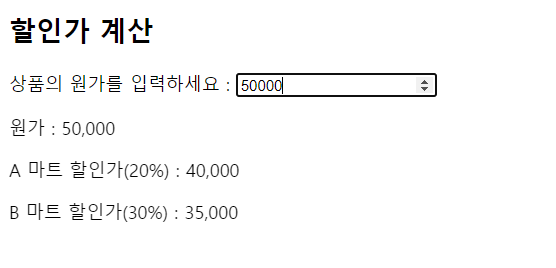

## 22.08.11

## [🦊index1 소연 문제(짤랑이 뱅크2)]

### [문제설명]

1. `index1.html`을 생성하시오.

   <초기화면>

   input의 `type`은 `숫자`로 설정해라.

   

2. 다음 이미지를 참고하여 data()를 구현하시오.

   

3. `price` 필터를 `전역 필터`로 구현하시오.
   - `price` 필터
     - value매개변수가 없으면, value매개변수를 그대로 출력하시오.
     - value매개변수가 있으면, value를 [`/\B(?=(\d{3})+(?!\d))/g, ‘,’`] 정규식으로 대체하시오.

 

4. `watch` 를 써서 구현하시오.

- 미국 환율: 1달러 = 1302원
- 중국 환율: 1위안 = 193원

5. input을 `숫자`로 설정했기에 `위/아래 화살표`를 클릭하면 전체 환율이 `저절로` 바뀌는 것을 확인한다.
   

### [문제 포인트]

- filter
- watch

### [알게된 점/추가할 점]

- 달러나 위안의 금액을 소수점 둘째자리 까지만 표현하게 해야 겠다.
- watch는 값을 보고 있다가 new값과 old값을 이용할 수 있다.
- computed는 새로운 함수를 만들어줘야하고 무조건 return이 필요하다.
- 여기서 watch를 쓰라고 한 이유: computed를 하면 내부 변수를 최종값으로 쓰지 못하고 return으로만 해야하는데 watch는 내부 변수를 최종값으로 바꿀 수 있다. `this.usa = n / 1302;`

### [출력 예시 화면]

## [🐼index2 길연 문제(할인가 계산)]

### [문제설명]

1.  상품의 원가를 입력하면 할인가를 출력하는 프로그램 `index.htm`l을 구현하시오.

2.  `input` 의 타입은 `숫자`로 설정하시오.

3.  다음 이미지를 참고하여 data()를 구현하시오.원가, A 마트 할인가, B 마트 할인가는 p 속성을 사용하여 구현한다.

4.  원가, A 마트 할인가, B 마트 할인가는 `p` 속성을 사용하여 구현한다.

5.  A 마트와 B마트는 해당 상품을 각각 20%, 30%을 할인하고 있다. 두 마트의 할인가를 계산하는 `cal1`과 `cal2`함수를 `computed`를 사용하여 구현하시오.

6.  `won` 필터를 전역 필터로 구현하시오.

    - `value`매개변수가 없다면 `value`를 그대로 출력하고, 있다면 `value`를 `[/\B(?=(\d{3})+(?!\d))/g, ',']` 정규식으로 대체하시오.

7.  원가와 A마트 할인가, B마트 할인가 모두 `won`필터를 적용하시오.

### [문제 포인트]

- filter
- computed

### [출력 예시 화면]

#### <참고 화면 1 - 초기 화면>

#### <참고 화면 2 - 출력 예시>

