## 22.08.12

## [🦊index1 소연 문제(의류 관리 사이트)]

### [문제설명]

1. **`index1.html`을 생성하시오.**

   #### <초기화면>

   - `비밀번호`는 input에서 안 보이게 설정해라.

     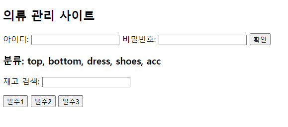

2. **다음 이미지를 참고하여 `data`를 구현하시오.**

   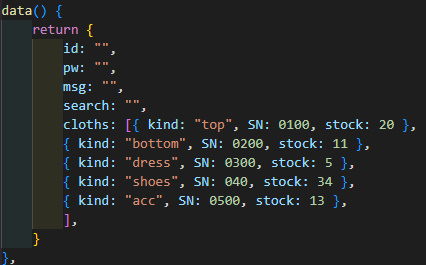

3. **아이디와 비밀번호 폼**

- `확인 버튼`을 누르면 `http://www.naver.com`으로 이동하게 설정하라.
- 아이디와 비밀번호 `유효성 검사`를 하고 밑에 `문구`가 출력 되게 하여라.
  - `아이디`에서 타자를 칠 때마다 `idCheck 함수`를 호출하게 하여라.
  - `비밀번호`에서 타자를 칠 때마다 `pwCheck 함수`를 호출하게 하여라.

4. **아이디 체크 함수(idCheck)**

- id는 5자리 이상 12자리 이하이다.

  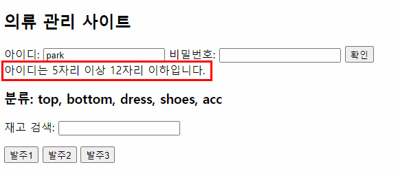

- 'admin'이라는 id는 사용할 수 없다.

  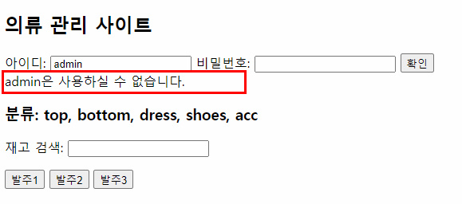

- 그 외는 모두 사용 가능하다.

  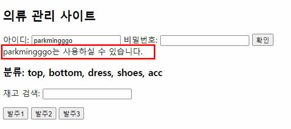

5. **비밀번호 체크 함수(pwCheck)**

- 비밀번호는 8자리 이상 20자리 이하이다.

  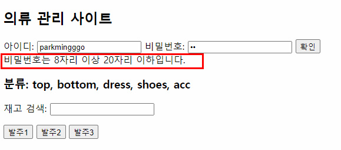

- 아이디와 비밀번호가 동일하면 사용할 수 없다.

  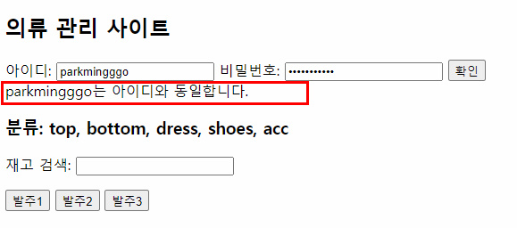

- 그 외는 모두 사용 가능하다.

  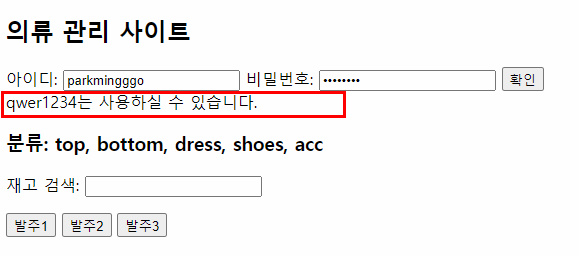

6. **재고 검색**

- 반복문의 `key`는 `cloths의 SN`으로 설정하여라.

- 분류 중에 선택해서 검색하면 해당 `재고`가 나온다.

  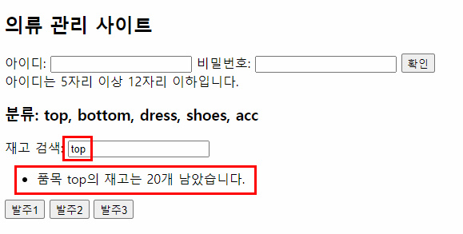

  

7. **발주 폼**

- 발주1 버튼

  - 전달 인자: `안녕하세요 발주1` / 매개변수: `msg`

    

  - 버튼을 클릭하면 `http://www.google.com`으로 이동한다.

- 발주2 버튼

  - 전달 인자: `이벤트`, `안녕하세요 발주2` / 매개변수: `e`, `msg`

    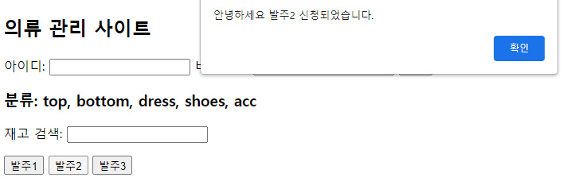

  - 버튼을 클릭하면 이벤트 함수로 페이지 이동을 막는다.

  - 알림창이 뜨면 버튼이 ‘`발주완료`’로 바뀐다.

    

- 발주3 버튼

  - 전달 인자: `없음` / 매개변수: `없음`

    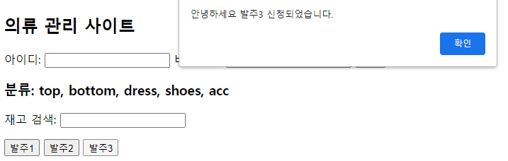

  - 클릭하면 `prevent`로 이동을 막는다.

  - 알림창이 뜨면 버튼이 ‘`발주완료`’로 바뀐다.

    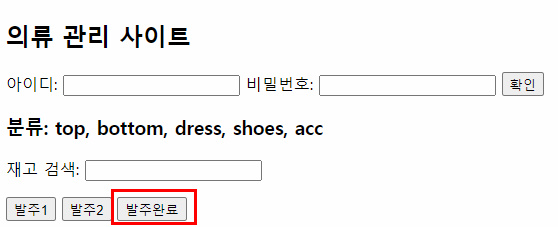

### [문제 포인트]

- v-on의 keyup 이벤트
- v-for
- form의 action
- 이동막기: prevent, if (e) e.preventDefault()
- 이벤트로 매개변수와 인자값

### [알게된 점/추가할 점]

- ES6에서 ${} 사용하려면 백틱(``) 까먹지말기

## [🐼index2 길연 문제(To Do List)]

### [문제설명]

1. `index.html`을 생성하시오.

2. 다음과 같은 **To Do List**를 구현하려고 한다.

   #### <참고 화면 1 - 초기 화면>

   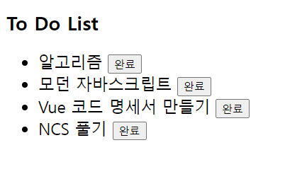

3. 다음 이미지를 참고하여 `data`를 구현하시오.

   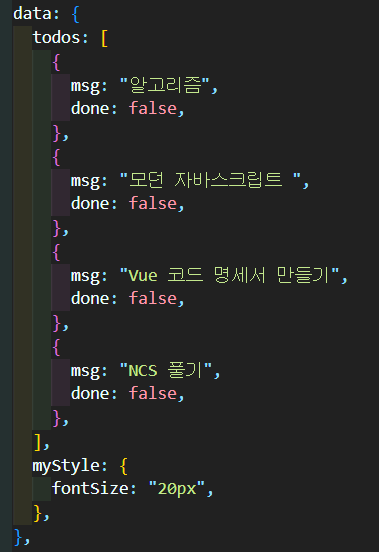

4. `ul` 태그를 사용하여 `data`의 `todos`가 순서가 없는 리스트로 구현되도록 하시오.

5. 다음 이미지를 참고하여 `style`에 `completed`라는 클래스를 생성하시오.

   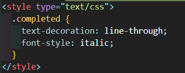

6. 각 목록 리스트인 `li`에 `v-bind`를 사용하여 `data`의 `mystyle`과 `style`의 `completed` 클래스를 적용하시오.

7. `method`에 `todo`의 객체를 인자값으로 갖는 `complete` 메소드를 구현하시오.

   - `complete` 메소드

   > (1) todo의 `done`이 `fasle`라면, `done`을 `true`로 바꾸고 버튼 안에 텍스트를 "취소"로 바꾸어라.

   > (2) todo의 `done`이 `true`라면, `done`을 `fasle`로 바꾸고 버튼 안에 텍스트를 "완료"로 바꾸어라.

8. 각 목록 옆에 버튼을 생성하고 클릭하여 todo의 목록을 인자값으로 갖는 `complete` 메소드를 호출하시오.

### [문제 포인트]

- class binding
- style binding

### [알게된 점/추가할 점]

- v-for의 객체 자체를 인자값으로 전달할 수 있다.
- 이밴트를 사용하여 버튼의 text를 바꿀 수 있다.

### [출력 예시 화면]

#### <버튼을 클릭했을 때>

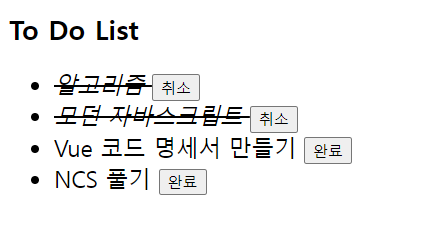

#### <완료된 목록의 버튼을 다시 클릭했을 때>

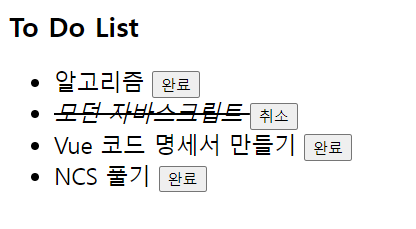
