## 22.08.16

## [🦊index1 소연 문제(상상만으로 행복한 설문조사)]

### [문제설명]

1. **`index1.html`을 생성하시오.**

   ### <초기화면>

   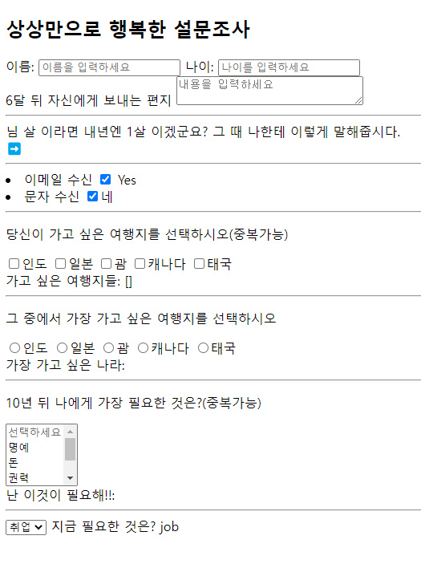

2. **다음 이미지를 참고하여 `data`를 구현하시오.**

   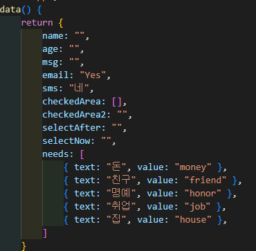

3. **이름/나이/편지**

- 이름 입력 칸 : `앞, 뒤 공백을 제거`하도록 설정하여라.
- 나이 입력 칸 : 칸 안에는 text도 쓸 수 있으나, 입력하면 `숫자`로 전달하게 설정하여라.
- 편지 쓰는 칸 :

  - `크기`(가로: 30/세로:0)
  - 편지를 `다 쓰고 난 후`에야 메시지가 출력 되게 만들어라.

    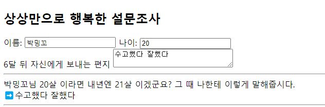

1. **이메일/문자 수신**

- 이메일:
  - 수신O: “`Yes`” / 수신X: “`No`”
  - 미리 `체크`가 되어 있다.
- 문자:

  - 수신O: “`네`” / 수신X: “`아니오`”
  - 미리 `체크`가 되어 있다.

    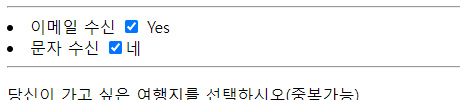

    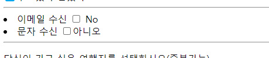

1. **가고 싶은 여행지(데이터: checkedArea)**

- `중복` 선택 가능
- `value: India/Japan/Guam/Canada/Thailand`

  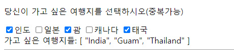

1. **가장 가고 싶은 여행지(데이터: checkedArea2)**

- 중복 선택 `불가능`
- `value: India/Japan/Guam/Canada/Thailand`

  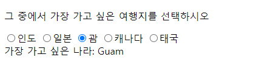

1. **10년 뒤 나에게 가장 필요한 것은?(데이터: selectAfter)**

- `중복` 선택 가능
- 맨 위에는 “`선택하세요`”는 선택할 수 없도록 한다.
- `value: honor/money/power/happiness/family`

  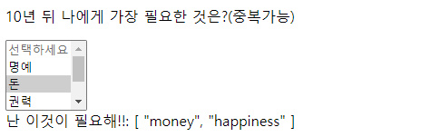

1. **가장 필요한 것은?(데이터: selectNow)**

- `반복문`으로 select박스가 한 줄만 보이게 설정하여라

  

- 화면이 뜨자마자 ‘job’이 보이게 한다.
- select가 열렸을 때 참고 화면

  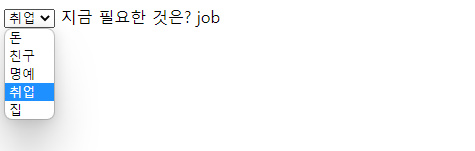

### [문제 포인트]

- input biding

### [알게된 점/추가할 점]

- created로 초기값 설정
- 중복은 배열로, 중복 불가능이면 단일값으로 data설정

## [🐼index2 길연 문제(회원가입)]

### [문제설명]

1. `index.html` 을 생성하시오.
2. 다음과 같은 회원 가입 폼을 구현하시오.

## <참고 화면 1 - 초기 화면>

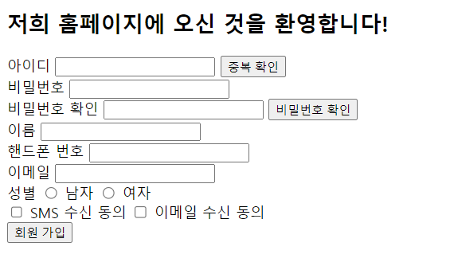

3. 다음 이미지를 참고하여 `data`를 구현하시오.

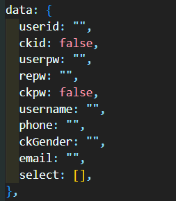

4. 아이디 중복 확인

- `input` 속성에 아이디를 입력하고 중복 확인 버튼을 클릭하면 `ckID` 라는 메소드를 호출하시오.
- `ckID` 메소드

      (1) 입력한 아이디가 admin이라면 **"중복된 아이디입니다.”**라는 알림창이 뜬다.

      (2) 중복되지 않았다면 **“아이디 중복 확인이 완료 되었습니다.”**라는 알림창이 뜬다.

  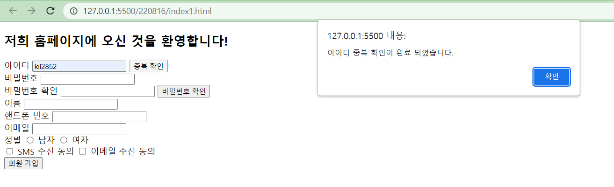

      (3) 알림창의 확인 버튼을 누르면 중복 확인 버튼의 문구가 **“확인 완료”**라고 바뀐다.

  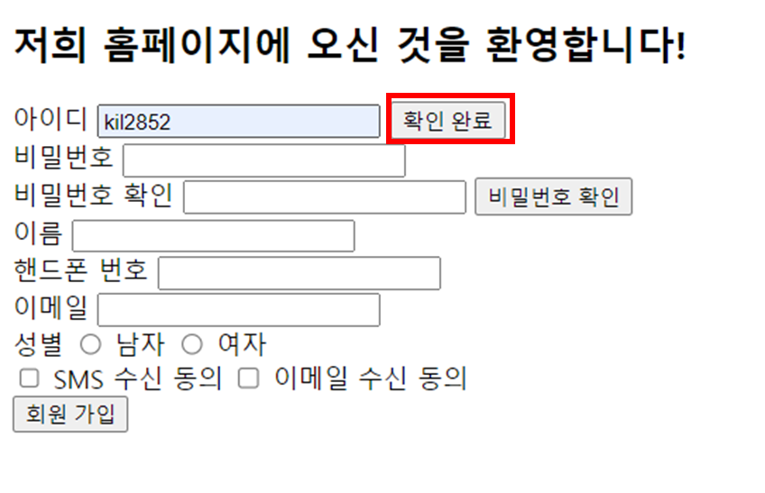

5. 비밀번호 확인

- `input` 속성에 비밀번호를 입력하고 중복 확인 버튼을 클릭하면 `ckPW`라는 메소드를 호출하시오.
- `ckPW`메소드

      (1) 입력한 비밀번호와 비밀번호 확인칸에 입력한 비밀번호가 같다면 **"비밀번호가 확인 되었습니다.”** 라는 알림창이 뜬다.

  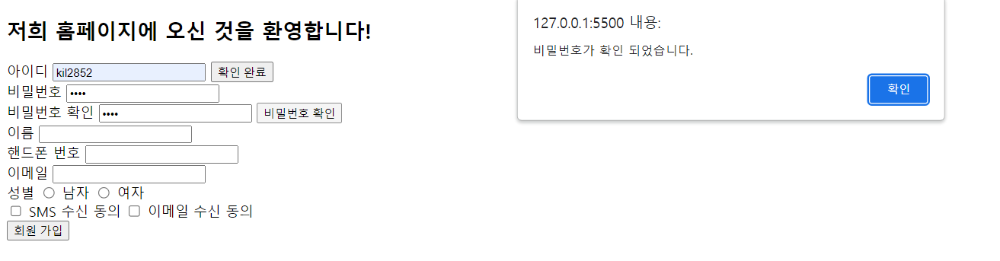

      (2) 알림창의 확인 버튼을 누르면 비밀번호 확인 버튼의 문구가 **“확인 완료”**라고 바뀐다.

  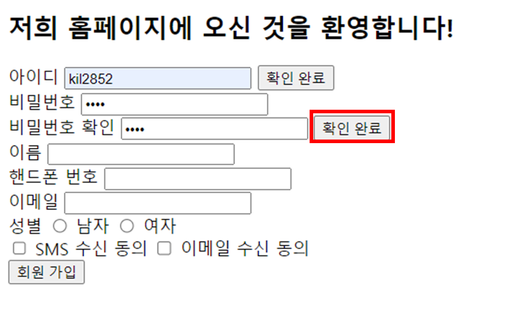

      (3) 반면에 버튼을 눌렀을 때 비밀번호가 다르다면 **"비밀번호가 다릅니다.”**라는 알림창이 뜬다.

  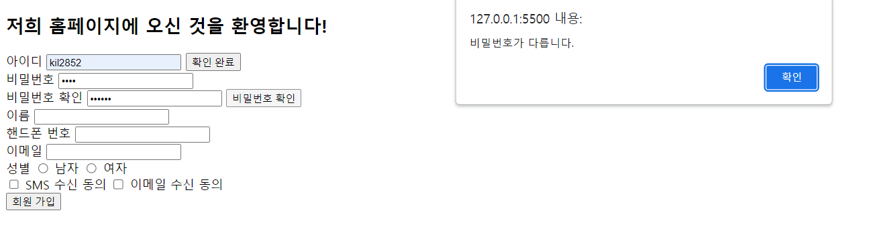

6. 이름, 핸드폰 번호, 이메일은 모두 `input`의 `text`로 구현한다.
7. 성별은 `radio button`으로 구현하여 남자, 여자 중 하나만 선택할 수 있도록 한다.❓
8. 수신 동의는 `checkbox`로 구현하여 중복 체크할 수 있도록 한다.
9. 회원 가입 버튼을 누르면 `checkVal`이라는 메소드를 호출한다.

- `checkVal` 메소드

(1) 아이디를 입력하지 않았으면 **"아이디 입력!”**이라는 알림창이 뜨도록 한다.

(2) 아이디를 중복 확인하지 않았으면 **"아이디를 다시 확인해주세요.”**이라는 알림창이 뜨도록 한다.

(3) 비밀번호를 입력하지 않았으면 **"비밀번호 입력!”**이라는 알림창이 뜨도록 한다.

(4) 비밀번호를 확인하지 않았으면 **"비밀번호를 다시 확인해주세요.”**이라는 알림창이 뜨도록 한다.

(5) 이름을 입력하지 않았으면 **"이름 입력!”**이라는 알림창이 뜨도록 한다.

(6) 핸드폰 번호를 입력하지 않았으면 **"핸드폰 번호 입력!”**이라는 알림창이 뜨도록 한다.

(7) 이메일을 입력하지 않았으면 **"이메일 입력!”**이라는 알림창이 뜨도록 한다.

(8) 성별을 체크하지 않았으면 **"성별 체크!”**이라는 알림창이 뜨도록 한다.

(9) 모두 다 확인했으면 `register`메소드를 호출한다.

- `register`메소드

(1) 알림창에 "**(사용자의 이름)님 가입해주셔서 감사합니다.**”라는 알림창이 뜨도록 한다.

### [문제 포인트]

- input binding

### [알게된 점/추가할 점]

- radio에서 중복 선택 안되게 할 때 : `value값`을 무조건 적어줘야 함 / name을 동일하게 작성하든지

- 내부 함수 호출할 때 `this`!!! 자꾸 까먹네..

- 처음엔 모두 if문으로 작성했다가 생각해보니 else if문을 써서 `클릭할 때마다` 오류난 부분으로 조건 이동하면 됐었다.

- 아이디 중복확인과 비밀번호 더블체크가 되면 해당 데이터를 true로 바꾸고 유효성 검사에서 최종 확인으로 검사한 점.. 많이 배웠다.(진짜 최고)🤔
