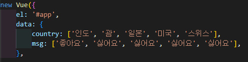
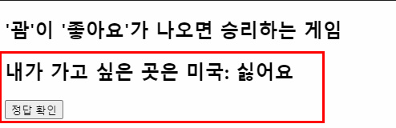
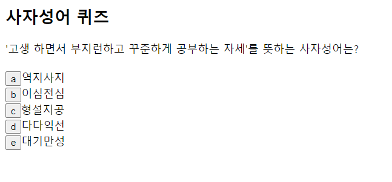
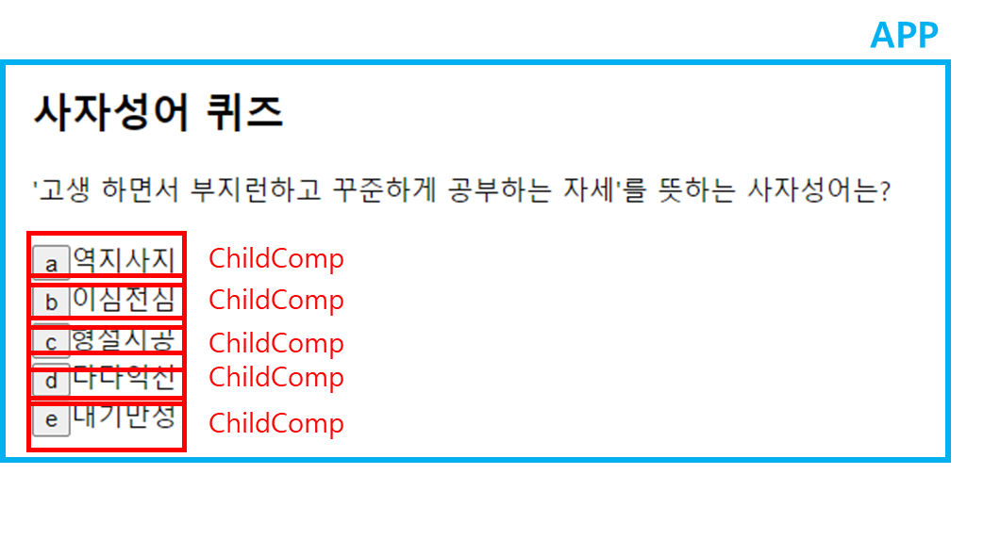
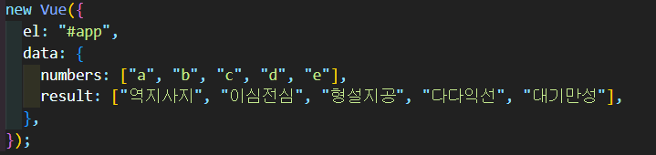
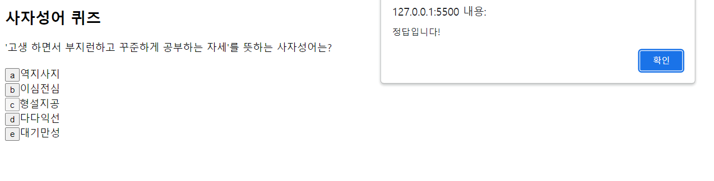
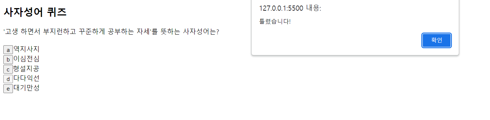

## 22.08.18

## [🦊index1 소연 문제(괌이 좋아요)]

### [문제설명]

1. **`index1.html`을 생성하시오.**

   ### <초기화면>

   

2. **다음 이미지를 참고하여 `data`를 구현하시오.**

   

3. **컴포넌트**

- 이름: `childcomp`는 ‘파스칼 표기법’으로 작성하여라.
- 탬플릿: `ChildComp`라는 아이디로 설정하고 탬플릿을 따로 빼라.

  - 탬플릿 영역

    

- props:
  - `country`: 문자열, 필수값
  - `msg`: 문자열, 필수값
- 메서드: `check()`

  - 나라 이름이 ‘괌’’이면서 메시지가 ‘좋아요’라면 알림창에 ‘`정답`’이라고 뜬다.

    

  - 아니라면 알림창에 ‘`실패`’라고 뜬다.

    

4. country와 msg는 `5의 배수(*5)`로 `랜덤`으로 나오게 한다.

### [문제 포인트]

- vue component간 통신

### [알게된 점/추가할 점]

## [🐼index2 길연 문제(사자성어 퀴즈)]

### [문제설명]

1. `index.html`를 생성하시오.
2. 다음과 같은 사자성어 퀴즈 페이지를 구현하시오.

## <참고 화면 - 초기 화면>

3. 이 페이지는 id가 `app`이라는 `div`안에 id가 `ChildComp`라는 컴포넌트 5개로 구성되어있다.

4. id가 `app`이라는 div의 data는 다음과 같다.

5. `props`을 이용하여 `app`의 `data`인 `numbers`와 `result`를 `childComp`에 전달하시오.

- `numbers`- type : String형
- `result`- type : String형, require: true

6. `childComp`에서 `numbers`와 `result`를 출력할 때 `v-for`를 이용하여 출력하시오.

7. `childComp`에서 `numbers`를 담은 버튼을 클릭하면 `select`라는 메서드를 호출하시오.

- `select` 메서드

  - 클릭한 버튼의 `numbers`가 “c”라면, **“정답입니다!”**라는 알림창을 출력하시오.

  

  - 클릭한 버튼의 `numbers`가 “c” 가 아니라면, **“틀렸습니다!”**라는 알림창을 출력하시오.

  

### [문제 포인트]

- vue component간 통신

### [알게된 점/추가할 점]

- 컴포넌트를 쓰면 그 안에서 for문을 2개 돌릴 수 없고 index를 이용하여 풀면 된다.
