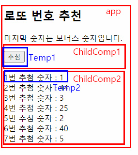
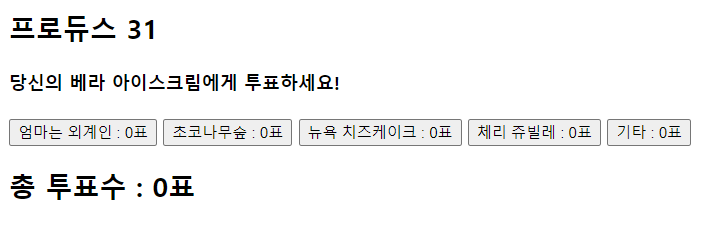
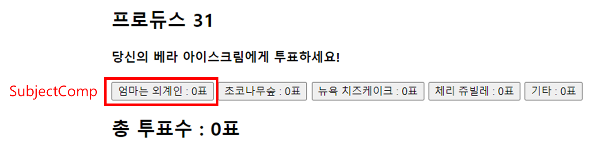
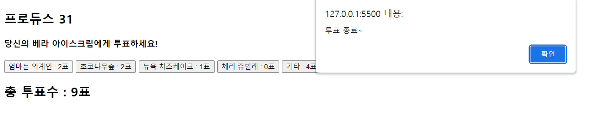

## 22.08.19

## [🦊index1 소연 문제(로또 추첨)]

### [문제설명]

1. **index1.html을 생성하시오.**

: 추첨 버튼을 누를 때마다 Temp2 영역의 글자가 나온다.

## <초기화면>

)

2. **vue의 `data`는 없다.**

   

3. **컴포넌트 1(**`ChildComp1`**)**

- 템플릿: `Temp1`
  - 버튼을 클릭하면 `send` 메서드를 호출해라.
- 데이터: `count:1`

4. **send 메서드**

- `const bus`를 만들고 `Vue생성자 함수`를 만들어라(**비 상하위간 통신).**
- bus에 ‘`updateChild2`’라는 이름으로 `count`데이터를 전달한다.

5. **컴포넌트 2(**`ChildComp2`**)**

- 템플릿: `Temp2`
  - 7개 까지 출력하게 한다.
  - 데이터 list에서 가져오게 한다.
- 데이터: `list[]`
- ChildComp2가 생성되자마자(created) bus에 ‘`updateChild2`’라는 이름으로 본인이 갖고 있는 `updateChild2` 메서드를 호출한다.

6. **updateChild2 메서드**

- list에 1 ~ 45 까지 랜덤으로 넣는다. → 참고: `Math, floor(), random()`

### [문제 포인트]

- 비상하위간 통신

### [알게된 점/추가할 점]

- 사용자 정의 이벤트, 하위에서 상위로 이벤트 전달과 헷갈렸다.

## [🐼index2 길연 문제(프로듀스 31)]

### [문제설명]

1. 아이스크림 투표 페이지 `index.html`를 구현하시오.

   ## <초기 화면>

   

2. **하위 컴포넌트** `SubjectComp`

script 문안에 vue.component를 이용해서 이름이 `SubjectComp`라는 컴포넌트를 구현하여라.

- data : `count`- int형
- prop : `title`- String형, 필수값
- 버튼 : 버튼을 누르면 `addCount`라는 메서드를 호출한다.
- 메서드 : `addCount`

       - `count` 1 증가

       - 상위 컴포넌트인 `app`의 메서드 `addTotalCount`라는 메서드 호출

3. 상위 컴포넌트 `app`

- data : `total`- int형
- 메서드 : `addTotalCount`

  - `total` 1 증가

  - `total`이 10이라면 "**투표 종료~**"라는 문구가 담긴 알림창이 뜬다.

9표일 때 버튼을 한번 더 누르면 알림창이 뜬다.

그 후 알림창의 확인 버튼을 누르면 총 투표수가 10표가 된다.

### [문제 포인트]

- 상위에서 하위로 data 전달
- 하위에서 상위로 event 전달

### [알게된 점/추가할 점]

- 버튼을 클릭한 다음에 총 투표수가 올리가니까 9에서 조건문을 탈출해야 한다는 점
