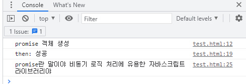
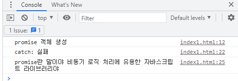
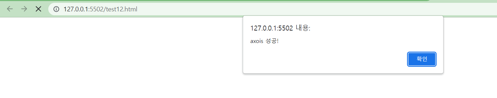
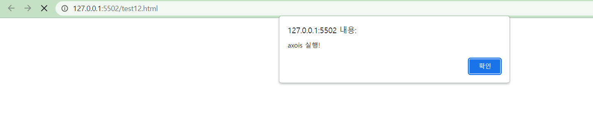

## 22.08.22

## [🦊index1 소연 문제(axios 기본)]

### [문제설명]

1. `index.html`를 생성하시오.
2. `const promise`를 만들고 `promise`객체를 생성하시오.
3. `promise` 객체가 생성되면 콘솔창에 “`promise 객체 생성`”문구가 나오게 하라.
4. `resolve` 매개변수엔 “`성공`”을 `reject` 매개변수엔 “`실패`”를 전달해라.
5. `promise`객체가 정상적으로 보내졌다면

   

6. `promise`객체가 정상적으로 보내지지 않았다면
   

### [문제 포인트]

- axios의 promise

## [🐼index2 길연 문제(axois 기본)]

### [문제설명]

1. `index.html`를 생성하시오.
2. `const promise`를 만들고 `promise`객체를 생성하시오.
3. `promise`에 `resolve` 함수를 호출하고 **“axois 성공!”**이라는 문자열을 보내시오.
4. `promise`객체가 정상적으로 보내졌다면 `resolve`에 보낸 문자열이 뜨는 알림창을 뜨게 하시오.

5. `resolve`함수가 호출된 후에는 알림창의 확인을 누르면 `finally`에서 **“axois 실행!”** 문자열이 뜨는 알림창을 뜨게 하시오.

### [문제 포인트]

- axios의 promise
