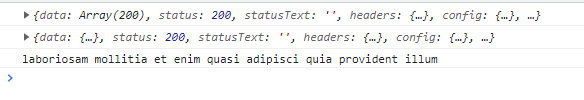
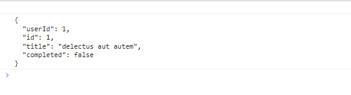
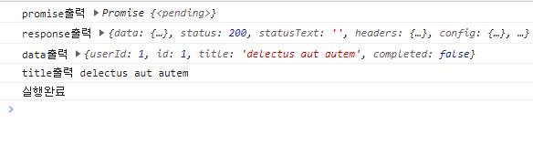
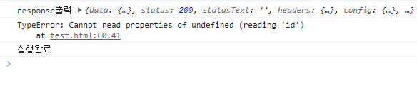
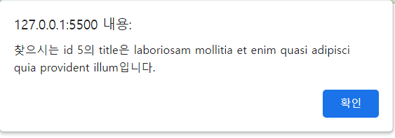
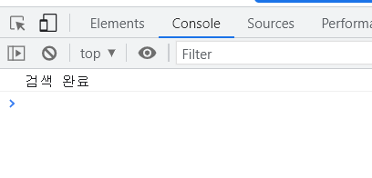

## 22.08.25

## [🦊index1 소연 문제(ajax, axios 완전 이해)]

### [문제설명]

1. `index.html`를 생성하시오.
2. axios의 CDN을 추가하시오

```
<script src="https://cdn.jsdelivr.net/npm/axios/dist/axios.min.js"></script>
```

3. `then지옥에서 탈출`하는 방식으로 구현

- `URL상수`의 값을 https://jsonplaceholder.typicode.com/todos로 설정하시오.
- 함수 `getInfo`

  - promise를 반환하게 설정하시오.
  - 매개변수: URL
  - `response` 상수: 매개변수 URL을 axios로 가져온다. → log로 response를 찍어 확인하기
  - `id` 상수: response의 data의 5번째 있는 id를 가져온다.
  - `realURL` 상수: `URL 매개변수`과 `id 상수`를 이용하여 주소창에 `5번째 있는 id의 data만 가져오게 설정`하라. → log로 realURL을 찍어 확인하기
  - log출력: `realURL`을 이용하여 `title`을 출력하라.
  - 상수들은 값을 받아올 때까지 기다리게 설정하여라.\

  <최종 출력>

  

4. 위 설명을 참고하여 `순수 ajax`로 구현하시오.

- `URL상수`의 값을 https://jsonplaceholder.typicode.com/todos/1로 변경하시오.
- `xhr` 상수 : xml을 request
- `response` 상수 : xhr을 response → log로 response찍어보기→ 상태가 어떤가?
- xhr의 상태가 ‘정상’이 되었을 때 response실행해보기

  <최종 출력>

  

5. 위 설명을 참고하여 `axios의 promise`를 사용하여 구현하시오.

- `URL상수`의 값을 https://jsonplaceholder.typicode.com/todos/1로 변경하시오.
- `promise` 상수 : axios로 URL을 가져온다.
- promise에서 then
  - 첫 번째 then의 return : data
  - 두 번째 then의 return : title
- promise에서 catch
  - 매개변수 error를 넣고 log에 error출력
- promise에서 finally

  - log에 “실행완료” 출력

    <최종 출력>

    

6. 위 설명을 참고하여 `promise 변수를 따로 선언하지 않는 axios`의 방식으로 구현하시오.

- then
  - 첫 번째 then의 return : 5번째 data의 id
  - 두 번째 then의 return : axios에서 ‘url/id’
- catch
  - 매개변수 error를 넣고 log에 error출력
- finally

  - log에 “실행완료” 출력

    <최종 출력>

    
    → 에러를 없애려면? URL을 https://jsonplaceholder.typicode.com/todos로 변경하시오.

### [문제 포인트]

- ajax, axios then지옥, axios then지옥 but 바로 불러오는 법, async와 await

### [알게된 점/추가할 점]

- 5번째는 [4]인데..

<hr/>

## [🐼index2 길연 문제(axois 이해)]

### [문제설명]

1. `index.html`를 생성하시오.
2. `URL`상수의 값을 [https://jsonplaceholder.typicode.com/todos로](https://jsonplaceholder.typicode.com/todos%EB%A1%9C) 설정하시오.
3. 함수 `getTodo`를 구현하시오.

- `response`상수 : 매개변수 URL을 axios로 가져온다.
- `id`상수 : `response`의 data의 5번째 있는 id를 가져온다.
- `todo`상수 : 매개변수 `URL` 과 상수 `id`를 이용하여 5번째 있는 id의 data를 가져온다.

4. 함수와 상수들은 각각 `async` 와 `await`를 사용하여 값을 받아올 때까지 기다리게 설정하여라.
5. 프로그램을 실행시키면 **"찾으시는 id (5번째 data의 id)의 title은 (5번째 data의 title)입니다.”**라는 문구가 뜬 알림창을 띠워라.



6. 위 프로그램을 상수를 선언하는 대신에 `axois`의 `then`함수를 사용하여 구현하여라.

(이때 promise 변수는 따로 선언하지 않는다.)

- 첫번째 `then` : 매개변수는 `response`, `response`의 5번째 data의 id를 반환
- 두번째 `then` : 매개변수는 `id`, axois를 이용해 `${URL}/${id}` 를 반환.
- 세번째 `then` : 매개변수는 `todo`, 위와 마찬가지로 **"찾으시는 id (5번째 data의 id)의 title은 (5번째 data의 title)입니다.”** 라는 문구가 뜬 알림창을 띠워라.
- axois의 `catch` 함수 : 매개변수는 `errer`, log를 사용해서 콘솔창에 errer를 출력해라.
- axois의 `finally` 함수 : 매개변수 없음. then함수가 정상적으로 실행되어 알림창까지 뜬 후, 알림창의 확인 버튼을 누르면 콘솔창에 **“검색 완료”**가 출력된다.



### [문제 포인트]

- axios then지옥 but 바로 불러오는 법, async와 await

### [알게된 점/추가할 점]

- 주소창에 todo/id를 이용하여 title를 볼 수 있는 방법❓-> 백엔드 영역, jqeury문 작성
