## 22.08.25

## [🦊index1 소연 문제(우리 동네엔?)]

### [문제설명]

1. index.html생성
2. vue와 axios CDN 생성

```html
<script src="https://cdn.jsdelivr.net/npm/axios/dist/axios.min.js"></script>
<script src="https://cdn.jsdelivr.net/npm/vue/dist/vue.js"></script>
```

3. 공공 데이터 포털에서 ‘소상공인시장진흥공단\_상가(상권)정보\_API’를 활용 신청 한다.

- 해당 데이터 url : [https://www.data.go.kr/tcs/dss/selectApiDataDetailView.do?publicDataPk=15012690](https://www.data.go.kr/data/15012005/openapi.do)

- 상세기능 목록에서 ‘행정동 단위 상가업소 조회’를 참고한다.

  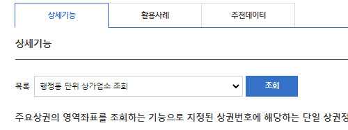

4. CORS 켜기

5. body부분

- id가 `app` div안에 id가 `result`인 div생성
- table을 생성하고 다음 그림과 같이 만들어라.

  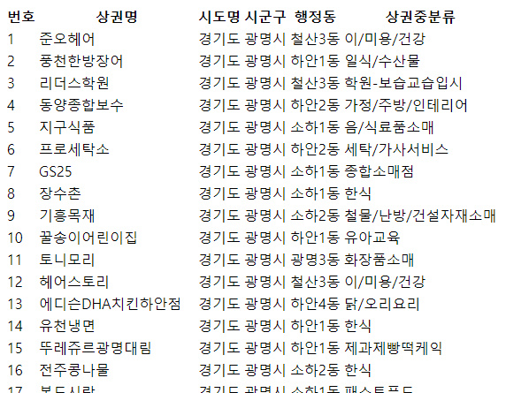

- 다음과 같이 출력결과 항목을 사용하여 테이블 안에 data를 출력하시오.

  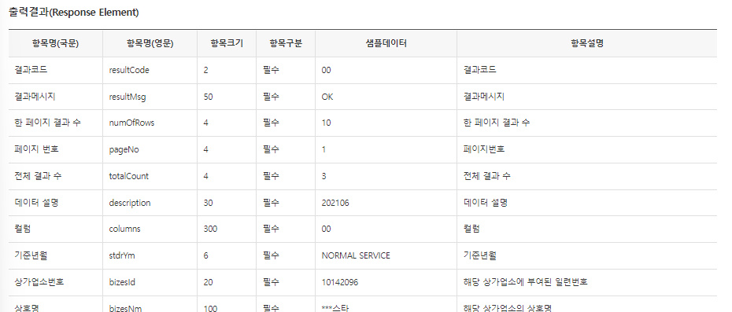

6. body의 script부분

- API, address 상수 생성

  - API : 본인 인증키
  - address : 서비스 요청 주소
    ※ 활용신청 상세기능 정보의 `요청변수`를 참고할 것: 데이터는 `100개`/본인이 사는 `시군구`/타입은 `json`/업종은 `모든 업종을` 불러온다

  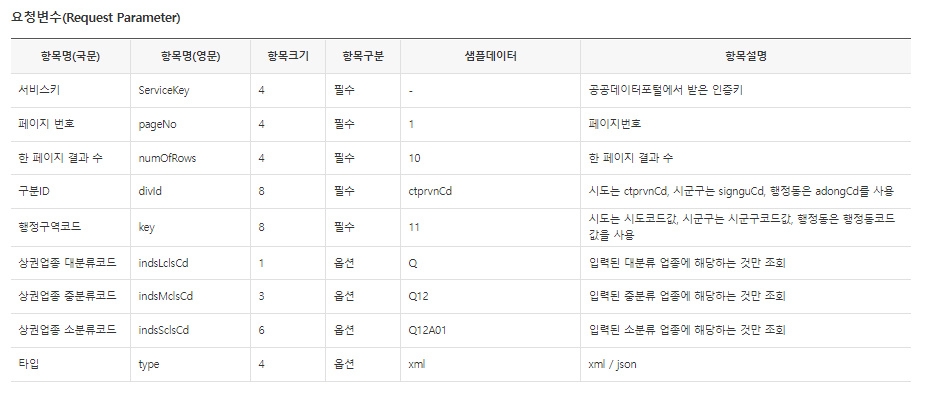

  ※ 시군구 코드는 [https://www.code.go.kr/stdcode/regCodeL.do](https://www.code.go.kr/stdcode/regCodeL.do) 참고

- vue 생성

  - data

    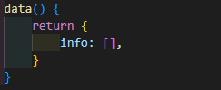

  - created

    - axios로 address를 가져온다.
    - console.log로 `response.data.body.items`를 콘솔창에 출력해 데이터가 잘 들어갔는지 확인해본다.

    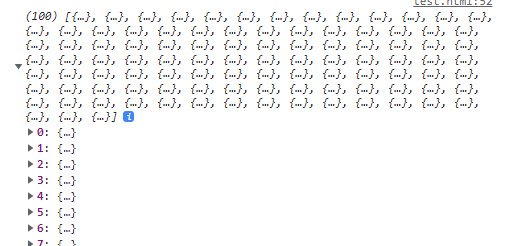

    - info배열에 log로 찍은 데이터 보내기

### [문제 포인트]

- Open API

### [알게된 점/추가할 점]

- 개발자모드에서 드롭다운이 없어서 고민 : json으로 type을 바꿔서 해결
- 공공데이터 포털에서 데이터마다 사용 설명서 읽으면 더 좋다
- 공공데이터 출력결과에 필수/옵션이 있다. 참고하여 address에 넣어줘야 한다.

<hr/>

## [🐼index2 길연 문제(공휴일 좋아)]

### [문제설명]

1. `index.html`을 생성하시오.
2. vue, axios의 cdn을 생성하시오.

```jsx
<script src="https://cdn.jsdelivr.net/npm/axios/dist/axios.min.js"></script>
<script src="https://cdn.jsdelivr.net/npm/vue/dist/vue.js"></script>
```

3. 공공데이터 포털에 **한국천문연구원\_특일 정보**를 활용 신청해 2022년 9월에 있는 공휴일을 출력하시오.

- 해당 데이터 url : [https://www.data.go.kr/tcs/dss/selectApiDataDetailView.do?publicDataPk=15012690](https://www.data.go.kr/tcs/dss/selectApiDataDetailView.do?publicDataPk=15012690)

4. body 부분

- id가 `app`인 div안에 id가 `result`인 div를 생성하시오.
- id가 `result`인 div안에 `<tr>, <td>` 속성을 활용해 다음과 같이 테이블을 구현하시오.
- `v-for`문을 활용해 다음과 같이 테이블 안에 data를 출력하시오.

  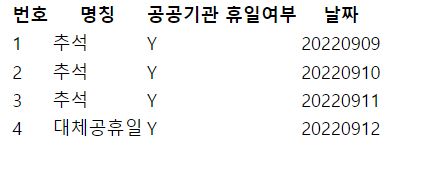

5. body의 script 부분

- const `API_KEY`: 본인의 서비스키
- const `address`: 서비스 요청 주소 - 아래 이미지와 해당 오픈 api 가이드를 참고해서 작성한다.

ex) 2019년 3월 공휴일 : [http://apis.data.go.kr/B090041/openapi/service/SpcdeInfoService/getHoliDeInfo?solYear=2019&solMonth=03&ServiceKey=서비스키](http://apis.data.go.kr/B090041/openapi/service/SpcdeInfoService/getHoliDeInfo?solYear=2019&solMonth=03&ServiceKey=%EC%84%9C%EB%B9%84%EC%8A%A4%ED%82%A4)

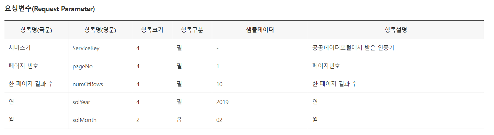

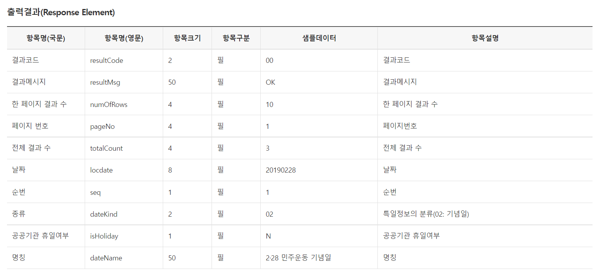

6. data()는 다음과 같이 구현한다.

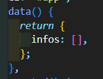

7. create()

- `address`를 axois로 가져온다.
- console.log로 `response.data.response.body.items.item`를 콘솔창에 출력해 데이터가 잘 들어갔는지 확인해본다.

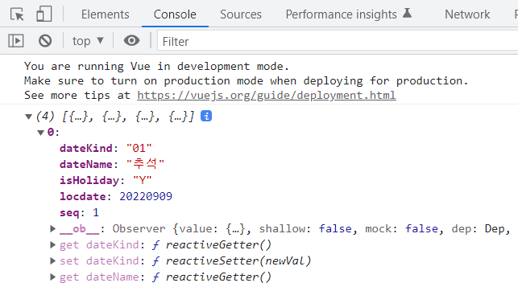

- `response.data.response.body.items.item`를 data의 `infos`에 넣는다.

### [문제 포인트]

- Open API

### [알게된 점/추가할 점]

- 해당 날짜만 요청변수로 불러오는 법
