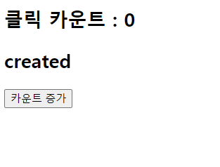
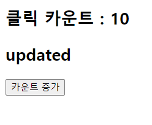

## 22.08.04

## [ index1 소연 문제 ]

### [문제설명]

1. `index.html`을 만들어라.

2. data속성 안에 `message: “안녕?” / number: 4885 / answer: “요데닌아”` 를 넣어라.

3. 다음 `화면`과 똑같이 출력해라.

### [문제 포인트]

- 함수를 이용하여 data의 속성값을 바꿀 수 있는가?(split(), join(), revere())

### [출력 예시 화면]

## [ index2 길연 문제 ]

### [문제설명]

- 버튼을 클릭하면 `카운트 값이 증가`하는 프로그램을 구현하시오.
- 처음 카운트 값은 0이고 버튼을 클릭하면 `1씩 증가`한다.
- 버튼을 처음 클릭한 후 created에서 updated로 변하는 메시지 state를 출력하시오.

### [문제 포인트]

- 클릭이벤트를 사용할 수 있는가?
- vue의 life-cycle을 이해하고 있는가?
- updataed를 이용하여 data속성을 이용하여 바꿀 수 있는가?

### [알게된 점]

- 부수효과 때문에 @click="count+=1", @click="count+1"은 안 되고, `count=count+1`로 하든 `count++`로 하든 둘 중 하나로 써야한다.
- vue객체 내부의 data값을 쓰기 위해선 this.~으로 해야한다.

### [출력 예시 화면]

💡버튼 클릭 전 화면

💡버튼 클릭 후 화면

