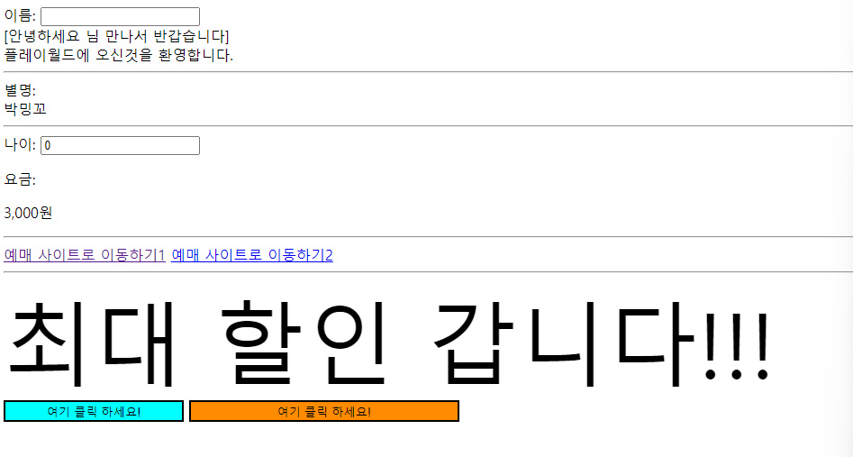
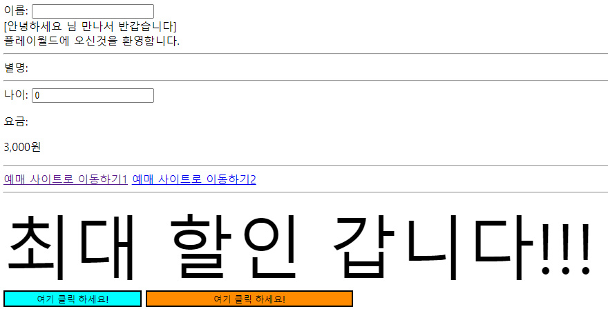
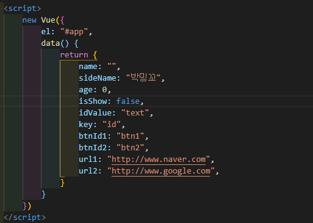
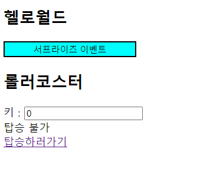
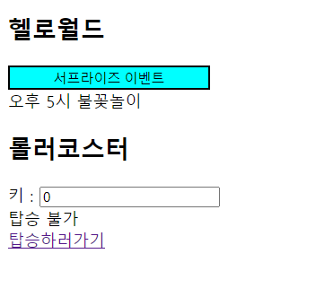
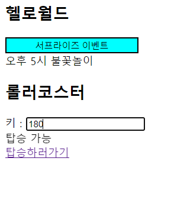

## 22.08.05

## [🦊index1 소연 문제 ]

### [문제설명]

- `index.html`로 만들어라
- 화면과 똑같이 만들어라: `hr속성` 사용하기

1. 이름: 이름을 입력하면 밑에 이름이 그대로 보이게 하라

2. 별명: 손님이 별명 보이기를 꺼려하여 ‘display:none’으로 설정되게 하라

3. 나이 / 요금: 나이가 6살 미만이면 3,000원 / 19살 미만이면 23,000원 / 70미만이면 34,000원 / 그 외는 무료로 설정하고, 나이를 입력하면 요금이 알아서 나오게 하여라

4. 예매사이트: 예매사이트1은 data속성에서 url1를 설정하여 사이트로 이동하게 하고
   예매사이트2는 이동 시 에러가 나게 만들어라

5. 최대할인 갑니다!!!: data속성에서 변수 key:”id”를 응용하여 id가 “text”로 설정한다. 그리고 css에서 글씨 크기를 100px로 설정하여 보이게 하라

6. 버튼 2개: data속성에서 변수 key:"id"를 만들고 key를 id로 설정하여 id가 btnId1과 btnId2인 클릭버튼을 만들어라.
   > 버튼1: 너비: 200px, 배경색: aqua  
   > 버튼2: 너비: 300px, 배경색: darkorange

### [문제 포인트]

- v-model
- v-show
- v-if / v-else-if / v-else
- v-bind: '[키값]'은 키의 값을: 주로 id와 class에 쓰임 / []이 없이 '키값'도 키의 값: 주로 style에서 ❓

### [알게된 점]

- v-bind: '[키값]'은 키의 값을: 주로 id와 class에 쓰임 / []이 없이 '키값'도 키의 값: → 그럼 :[key]=”btn1”으로 바로하면 되지 굳이..? -> 보안성?차원에서 일부러 키의 값을 감추려고?❓

### [출력 예시 화면]

💡 별명이 보일 때 
 
💡별명을 가릴 때 
 
💡script부분 
 

## [🐼index2 길연 문제 ]

### [문제설명]

- '서프라이즈 이벤트'라는 문구가 적힌 `버튼`을 만들어라.
- data에서 `key : id`를 생성하고 key를 button의 id로 설정하여 `id가 btn`이 되게 하라.
  > btn의 너비 : 200px, 배경색 : aqua
- data에 event라고 설정된 문자열이 이 `버튼을 클릭`할 때마다 나타나거나 나타나지 않게 하라.
- 단, 초기 화면에는 버튼 밑에 event 문자열이 보이지 않게 하고, 버튼을 클릭하면 보이게 하라.

- data에서 tall을 생성하고, 키를 입력하면 입력한 키에 따라 다음 문구가 나오게 하라.
  > 키 150이하 : 탑승 불가 
  > 키 150이상 : 탑승 가능

- data에서 url을 생성하고, '탑승하러가기' 라는 문구가 적힌 url을 클릭하면 사이트가 나오게 하라.

### [문제 포인트]

- v-bind
- 클릭이벤트
- v-model
- v-if / v-else-if/ v-else
- v-show

### [알게된 점]

- 버튼을 클릭하면 isShow의 상태가 false -> true -> false .. 으로 바껴야 하는데 @click="isShow=true"로 했다가 @click="!isShow"도 해보고 @click="isShow!=isShow"도 했다..

### [출력 예시 화면]

💡버튼을 클릭하지 않았을 때 초기 화면 

 

💡 버튼을 클릭했을 때 화면 

 

💡키에 150 이상을 입력했을 때 화면 

