## 22.08.09

## [🦊index1 소연 문제 ]

### [문제설명]

1. index.html을 생성하라.
2. 초기화면
   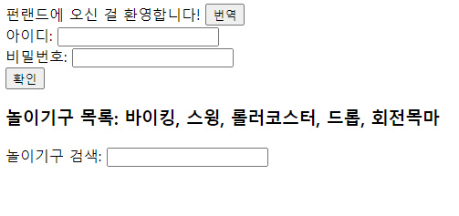
3. data속성 값들
   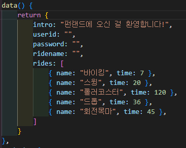
4. 기능 설명

- 번역 버튼을 누르면 trans함수가 호출되고 인트로 메시지가 영어로 바뀐다.
- 아이디를 입력하지 않으면 <참고 이미지1>과 같은 창이 뜬다.

### [문제 포인트]

- v-if
- v-for

### [알게된 점]

- 한글 → 영문 → 한글 바뀌는 부분 보완하기

### [출력 예시 화면]

💡참고 이미지1

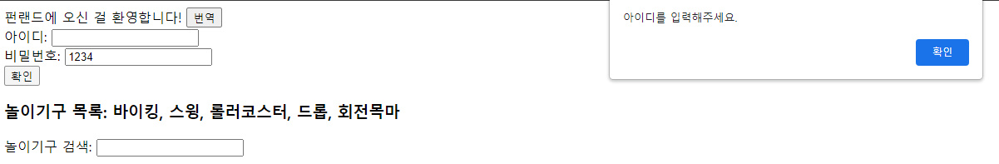

💡참고 이미지2

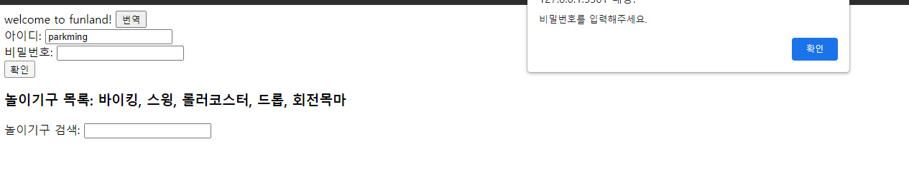

💡참고 이미지3

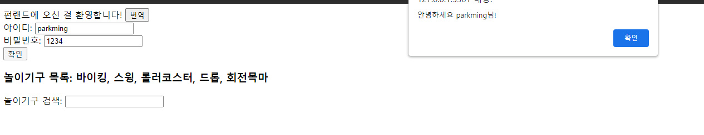

💡참고 이미지4

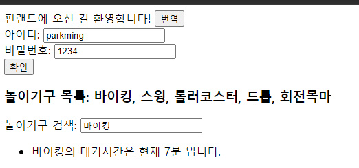

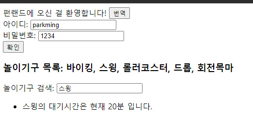

## [🐼index2 길연 문제 ]

### [문제설명]

1. index.html을 생성하시오.
2. 아이디와 비밀번호를 입력하면 로그인 되는 페이지를 구현하시오.
3. 다음 이미지를 참고하여 data()를 구현하시오.

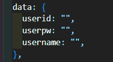

1. `checkVal` 메소드와 `register` 메소드를 구현하시오.
   - 사용자의 아이디 : id123, 비밀번호 : pw123
   - `checkVal` 메소드
     - 아이디를 입력하지 않았을 때 : “아이디 입력!” 알림 문구가 뜨게 하시오.
     - 비밀번호를 입력하지 않았을 때 : “비밀번호 입력!” 알림 문구가 뜨게 하시오.
     - 아이디가 틀렸을 때 : “아이디가 틀렸습니다!” 알림 문구가 뜨게 하시오.
     - 비밀번호가 틀렸을 때 : “비밀번호가 틀렸습니다!” 알림 문구가 뜨게 하시오.
     - 둘 다 틀렸을 때 : “아이디가 틀렸습니다!” 알림 문구가 뜨게 하시오.
     - 둘 다 맞았을 때 : `register` 메소드를 호출하시오.
   - `register` 메소드 : “로그인 완료!” 알림 문구가 뜨게 하시오. 그 후, 알림창의 확인을 누르면 data의 `username`을 “고길동”이라고 변경하시오.
2. 아이디와 비밀번호 입력은 `label` 과 `input` 속성을 사용하고, “로그인”이라는 문구가 들어간 `button` 을 클릭하면 `checkVal` 메소드를 호출하시오. 이때 input의 type을 변경하여 비밀번호는 text가 보이지 않게 하시오.
3. 로그인을 완료하면 `username` 이 나오는 메세지를 출력하시오.

### [문제 포인트]

- v-if

### [알게된 점]

- vue 내부 변수 선언 시 `this` 사용 하는 걸 까먹는다(함수 내에서)
- 함수 내부에서 함수를 호출할 때 `this` 쓰는 거 까먹음
- 함수 선언 시 `methods`에 감싸야 하는데 까먹음
- 둘 다 틀렸을 때 : “아이디가 틀렸습니다!” 알림 문구가 뜨게 하시오. : 둘 다 틀렸을 때 굳이 할 필요 있을까? 일단 아이디가 틀렸으니 조건문 우선순위에서 아이디 틀렸다고 나오고 → 비밀번호도 틀렸다면 비밀번호가 틀렸다고 나오지 않을까?

### [출력 예시 화면]

💡 <참고 화면 1 - 초기 화면>

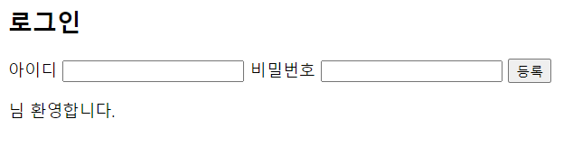

💡 <참고 화면 2 - 아이디가 틀렸을 때>

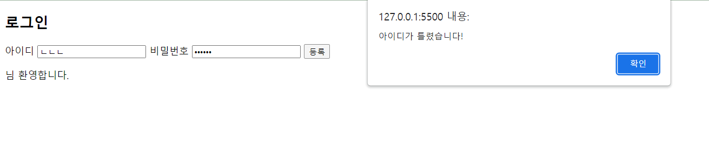

💡 <참고 화면 3 - 비밀번호가 틀렸을 때>

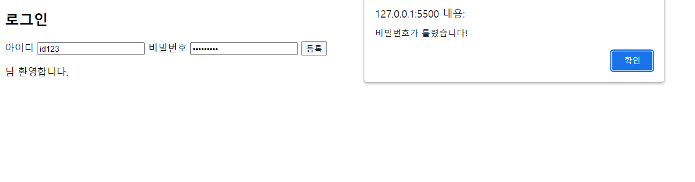

💡 <참고 화면 4 - 둘 다 맞았을 때>

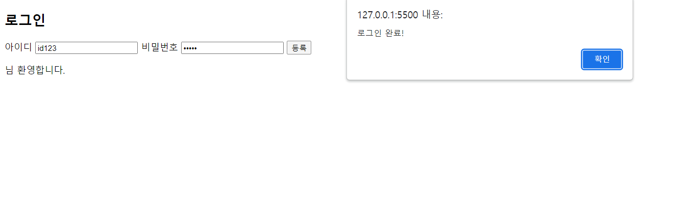

💡 <참고 화면 5 - 로그인 완료 화면>

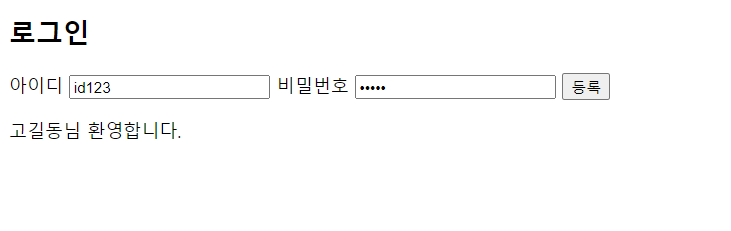
